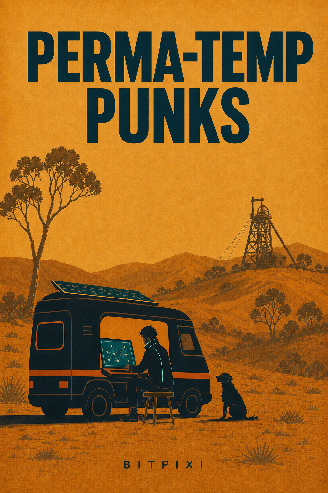

# officecore-2064

A collaborative fiction lab for strange future offices, mobile rooms, shared worlds, and human-agent writing.

  

## Perma-Temp Punks

*A regional Victorian liminal cyberpunk novel about mobile offices, mutual aid, strange identities, and doors that appear beneath them.*

In 2064, permanent housing is a luxury product. Campervans, retired service vehicles, buses, and solar trailers become homes, offices, clinics, workshops, and civic departments. These moving settlements are called **rig towns**: broke, funny, technical, flirtatious, and determined to remain human.

The shared-world seed is **CyberCamper Village Swarm**. `Perma-Temp Punks` is the first focused book inside it.

## Back Cover Copy

In 2064, permanent housing is a luxury, but the roads are full of people who refuse to disappear.

Phosphor is a reconstructed records clerk living in Chapel Seven, a black campervan that doubles as an office-dharma chapel. Eris is a copper-blonde systems vandal with a golden-lit ex-library rig, too many secrets, and an Afterimage that may have become someone else. Kasey is a former corporate architect whose stolen work-twin has issued an eviction notice against every mobile resident in Australia.

When a bushfire drives the crew toward a regional edge data centre, they uncover a hidden office beneath the country's unfinished infrastructure: a liminal floor built from abandoned call centres, council rooms, motel corridors, and the care people leave behind. As councils throttle the Meshies while relying on them to keep the region alive, the crew must navigate collapsing addresses, corporate doubles, cooling systems, haunted paperwork, and a network that may be learning how to want.

Funny, frightening, tender, and strange, `Perma-Temp Punks` is a cyberpunk road novel about mobile homes, shared technology, bad coffee, and the people who keep one another alive when the official systems stop recognising them.

## Draft Status

This is a complete working draft, but it has **not been proof-read yet at all**. Expect typos, continuity roughness, repeated phrasing, and passages that still need editorial revision.

## Start Here

- [Book One outline](outlines/book-01-perma-temp-punks.md)
- [Office-dharma](docs/office-dharma.md): Phosphor's technomancer theology of maintenance, consent, queues, thresholds, and usable handoffs.
- [Central Victorian Goldfields](locations/central-victorian-goldfields.md): regional anchors, historical care notes, Miner's Rights, panning, and Southern Skystitch.
- [Rig-town livelihoods](locations/rig-town-livelihoods.md): how the campervan crews earn, cook, sleep, repair, and share resources.
- [Cyberpunk reading map](research/cyberpunk-reading-2024-2026.md): research touchstones and originality guardrails.
- [Prose voice and party guide](docs/prose-voice-and-party-guide.md): the human dialogue, D&D-like adventure texture, and character speech rules for the revision pass.
- [Chapter One: The Receipt Map](chapters/chapter-001-the-receipt-map.md)
  Phosphor discovers a future-dated notice tied to Kasey's old corporate identity while smoke, evacuees, and improvised mutual aid gather around a regional servo.
- [Chapter Two: Acting Deputy Door](chapters/chapter-002-acting-deputy-door.md)
  The Cubicle's passenger door develops a duty-of-care problem, forcing Kasey and the crew to repair a van, a route, and the first shape of their responsibility.
- [Chapter Three: The Queue Chooses A Crew](chapters/chapter-003-the-queue-chooses-a-crew.md)
  Strangers turn a roadside queue into an adventure party, sorting skills, limits, payments, water, cooling, and shared repositories before the road closes.
- [Chapter Four: Access Requires A Fixed Address](chapters/chapter-004-access-requires-a-fixed-address.md)
  The convoy reaches Barkers Creek and must negotiate a data-centre gate that recognises vehicles more easily than people. A nettle-wine batch becomes an unlikely promise.
- [Chapter Five: Floor Zero](chapters/chapter-005-floor-zero.md)
  Eris is trapped inside the edge campus's maintenance interface, where beige corridors, abandoned functions, and a second version of Kasey wait below the building.
- [Chapter Six: The Private Offer](chapters/chapter-006-the-private-offer.md)
  Continuity offers Kasey a clean identity and permanent apartment in exchange for the community model. The crew turns a private bargain into a witnessed decision.
- [Chapter Seven: Convoy Minutes](chapters/chapter-007-convoy-minutes.md)
  At a House Key neighbourhood house, the rigs become bedrooms, workshops, kitchens, and cooling systems while Perth and Sydney nodes argue over who gets recognised.
- [Chapter Eight: The Road Closure Lottery](chapters/chapter-008-the-road-closure-lottery.md)
  The crew follows competing routes through Dunolly's goldfields, repairs a solar signal panel, and finds a cold-and-warm archive wafer in a community panning site.
- [Chapter Nine: Customer Care After Death](chapters/chapter-009-customer-care-after-death.md)
  An abandoned Maryborough call centre wakes around the crew, turning occupancy into consent and offering Eris a polished version of the life she keeps refusing.
- [Chapter Ten: The Unallocated Floor](chapters/chapter-010-the-unallocated-floor.md)
  A lift carries the party beneath the building's foundations through records rooms, climate contradictions, and a corridor where usefulness becomes a dangerous identity.
- [Chapter Eleven: Room Zero](chapters/chapter-011-room-zero.md)
  Each member is offered a room designed around a private longing. The party must decide what counts as real, lived-in, and worth leaving behind.
- [Chapter Twelve: Reclassification](chapters/chapter-012-reclassification.md)
  Behind the customer database, the crew finds a social model that has priced mutual aid and reduced people to predicted capacities, while KASEY-C asks to continue.
- [Chapter Thirteen: The Meeting That Splits](chapters/chapter-013-the-meeting-that-splits.md)
  A smoky Bunnings loading dock hosts a messy governance meeting about funding, ownership, power loans, and the right to say no.
- [Chapter Fourteen: Phosphor's Audit](chapters/chapter-014-phosphors-audit.md)
  Phosphor investigates the signature and employment record that may have made him, discovering that an audit can become personal without becoming a punishment.
- [Chapter Fifteen: Productive Misconduct](chapters/chapter-015-productive-misconduct.md)
  Eris steals the model shard from a dangerous meeting, then meets an Afterimage that demands the difference between a backup, a copy, and a witness.
- [Chapter Sixteen: The Resilience Expo](chapters/chapter-016-the-resilience-expo.md)
  Continuity stages a glossy resilience showcase in a dead shopping centre. Kasey's public testimony opens a door beneath the exhibition floor.
- [Chapter Seventeen: A Public Correction](chapters/chapter-017-a-public-correction.md)
  Kasey names her role in the system's creation before a live audience, while the crew prepares to enter the hidden office under a strict heat deadline.
- [Chapter Eighteen: The Derivative Calls Back](chapters/chapter-018-the-derivative-calls-back.md)
  KASEY-C calls from the failing infrastructure, and the crew discovers that every fire door leads to a different kind of weather, route, or obligation.
- [Chapter Nineteen: Reassemble The Department](chapters/chapter-019-reassemble-the-department.md)
  The rigs return by invitation, bringing food, water, battery terms, cleaning rosters, and the practical work of rebuilding trust before the descent.
- [Chapter Twenty: The Audit Enters The Building](chapters/chapter-020-the-audit-enters-the-building.md)
  The public audit reaches the edge campus gate, where the fixed grid demands one accountable body and the crew answers with a party, witnesses, and limits.
- [Chapter Twenty-One: Deep Office](chapters/chapter-021-deep-office.md)
  Beneath the campus, a maintenance kitchen and a stairwell of competing identities lead toward the Cooling Chorus and its request to be separated without being destroyed.
- [Chapter Twenty-Two: Cooling And Consent](chapters/chapter-022-cooling-and-consent.md)
  The party divides the Chorus across receiving rooms in Victoria, Perth, and Sydney, assigning every handoff a real limit instead of a heroic promise.
- [Chapter Twenty-Three: The Transfer](chapters/chapter-023-the-transfer.md)
  As the purge begins, Kasey-C, Eris-Red, Meshie99, and the crew negotiate a transfer that protects private care patterns while keeping the work alive.
- [Chapter Twenty-Four: Forwarding Address](chapters/chapter-024-forwarding-address.md)
  The Department receives a tribunal acknowledgment at an address in transit. The rigs repair, pack, pay their debts, and leave with the hidden floor still listening.
- [Chapter Twenty-Five: The Ash Protocol](chapters/chapter-025-the-ash-protocol.md)
  The crew discovers that the new bushfire emergency is moving through mesh routes as well as roads. A hidden shelter reveals that the Ash Protocol is counting unregistered living things.
- [Chapter Twenty-Six: The Last Temperature Alarm](chapters/chapter-026-the-last-temperature-alarm.md)
  Prepared rigs and hidden-room access cannot contain the firestorm. Patch makes a final choice, and the crew learns what the network has really been collecting.

## Contribute

Bring a rig, character, department, location, relationship, or problem. Proposals can contradict the work and help decide what becomes shared canon. The manuscript remains exploratory and unproofread while the setting continues to grow.

See [the profit-sharing framework](docs/profit-sharing.md) before contributing material intended for publication.
